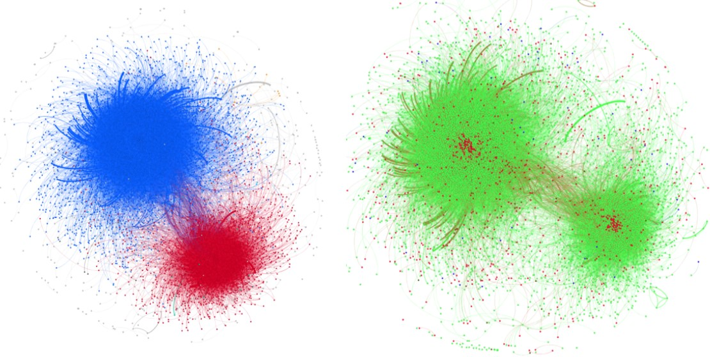

# Twitter-Bot-Detecttion-and-Analysis
This is a project of DATA130007.01 Social Network Mining(2021). We crawl Twitter data from 2020 us presidential election and try to analyze the  effect of bots during this election. 

The training dataset can be downloaded from http://mib.projects.iit.cnr.it/dataset.html.  
The election dataset can be crawled from Twitter according to the dataset https://github.com/echen102/us-pres-elections-2020. 

## Introduction
* The details of this project can be seen in the file **report.pdf**.
* The codes of bot detection implemented by lightGBM can be seen in folder **system1**.
* The codes of bot detection implemented by LSTM can be seen in folder **system2**.
* The codes of bot analysis can be seen in folder **system1**.

## Performance 
### The performance of system1 
| Methods       | Precision   | Recall  | Accuracy  | F1 score  |
| --------   | -----  | ----  |  -----  | ----  |
| Twitter Countermeasures     | **1.000** |   0.094     |   0.691 |   0.171    |
| Human Annotators      | 0.267 |  0.080    |   0.698 |   0.123    |
| Cresci et al        | 0.982 |   0.972     |   0.976 |   0.977    |
| Ahmed and Abulaish        | 0.945 |   0.944    |  0.943 |  0.944    |
| Our Model       | 0.996 |   **0.989**     |   **0.996** |   **0.992**    |
### The performance of system2 
| Type       | Precision   | Recall  | F1 score  |
| --------   | -----  | ----  |  -----  |
| Genuine Accounts     | 0.94 |   0.89     |  0.92    |
| Social Spam Bots      | 1.00 |  0.99   |   0.99    |
| Traditional Spam Bots        | 0.84 |   0.93     |   0.88    |
| Fake Followers        | 0.99 |   0.96    |  0.98   |
| Average       | 0.94 |   0.94     |   0.94   |
### Analysis
#### Proportion of Different Types of Accounts
| Type      | Number   | Proportion  |
| --------   | -----  | ----  |
| Genuine Accounts     | 7408 |   88.80%     |
| Social Spam Bots      | 839 |  10.04%   |
| Traditional Spam Bots        | 61 |   0.73%     |
| Fake Followers        | 45 |  0.54%    |
#### Network of Twitter Retweet Relations

By observing the location of bots, we can find that Social spam mainly exists in three parts of the network: The bots in network center has a high degree and is a transit point for the dissemination of opinion leaders’ tweets. Some social spams act as a bridge between the two communities. The retweet actions of bot are mainly controlled by computer programs and will not be affected by political tendencies. To a certain extent, the two opposing groups are contacted for information exchange by these bots. And some bots in the edge of the network are no longer retweeted by others and
have a decreasing importance.
